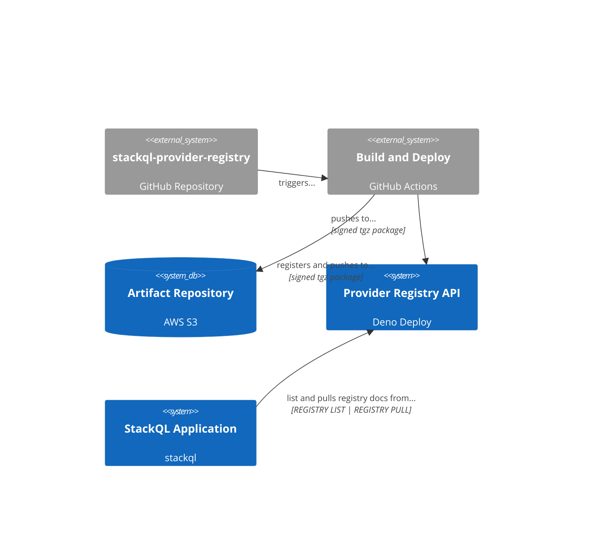

<!-- language: lang-none -->
[](https://github.com/stackql/stackql-provider-registry/actions/workflows/main.yml)


# StackQL Provider Registry

A repository of `provider` interface documents supporting [stackql](https://stackql.io/) ([stackql GitHub repo](https://github.com/stackql/stackql)). 

## Context


StackQL provider interface documents inform the stackql application on how to interact with a given provider (like `aws`, `azure`, `google`, etc), including what methods are available in the provider and how to invoke these using SQL semantics.  Provider interface documents are `yaml` formatted, OpenAPI specifications with extensions.  

The documents are versioned per provider in this repository, and built as signed and compressed as packaged artifacts.  The packaged artifacts are registered and published to the StackQL Provider Registry Artifact Repository in AWS S3.  The provider registry API is a [Deno Deploy](https://deno.com/deploy) application that serves the provider interface documents to the stackql application using the `REGISTRY LIST` and `REGISTRY PULL` commands.  

The following diagram shows the context of the provider registry:  



The public StackQL Provider Registry is distributed via [Deno Deploy](https://deno.com/deploy), using the following endpoints:  

| Endpoint | Description |
| --- | --- |
| [registry.stackql.app](https://registry.stackql.app/ping) | Production registry (built from `main`) |
| [registry-dev.stackql.app](https://registry.stackql.app/ping) | Development registry (built from `develop`) |

## Contributing

Please see [.github/CONTRIBUTING.md](/.github/CONTRIBUTING.md).

## Developing a Provider

StackQL providers are generated from provider OpenAPI or Swagger specifications (either supplied by the provider or constituted through other scripts - for example, [google-discovery-to-openapi](https://github.com/stackql/google-discovery-to-openapi) or [stackql-azure-openapi](https://github.com/stackql/stackql-azure-openapi)).  

Once you have an OpenAPI specification, you can use the [openapisaurus](https://github.com/stackql/openapisaurus) utility project to generate a StackQL provider document.  

## Build and Deployment Workflow

The provider registry is built and deployed using GitHub Actions.  Provider documents are validated and tested in workflow steps and then packaged and stored in the artifact repository.  The most recent packaged versions are published to the registry API (a [Deno Deploy](https://deno.com/deploy) application), where they are available from the `stackql` application using `REGISTRY LIST` or `REGISTRY PULL`.  See [docs/build-and-deployment.md](docs/build-and-deployment.md) for more information.  

## Testing a Provider using the `dev` Registry

Use the following steps to test a provider using the `dev` registry:  

```bash
export DEV_REG="{ \"url\": \"https://registry-dev.stackql.app/providers\" }"
./stackql --registry="${DEV_REG}" shell
```