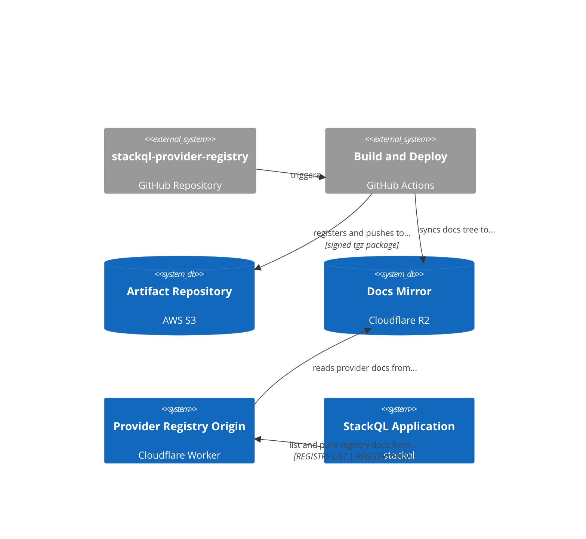

<!-- language: lang-none -->
[](https://github.com/stackql/stackql-provider-registry/actions/workflows/main.yml)


# StackQL Provider Registry

A repository of `provider` interface documents supporting [stackql](https://stackql.io/) ([stackql GitHub repo](https://github.com/stackql/stackql)). 

> [!IMPORTANT]
> New and updated provider revisions published after the signing cutover use
> quantum-safe ML-DSA-65 signatures. Signature verification requires
> **StackQL v0.13 or later** and remains opt-in, disabled by default. Existing
> provider revisions gain the new signatures as they are updated or republished;
> legacy revisions must be republished before they can pass the new verifier.
> See [signing and verification](docs/signing-and-verification.md).

## Table of Contents

<!-- BEGIN TABLE OF CONTENTS -->
- [Provider Catalog](#provider-catalog)
  - [Updating the Catalog](#updating-the-catalog)
- [Context](#context)
- [Contributing](#contributing)
- [Developing a Provider](#developing-a-provider)
- [Build and Deployment Workflow](#build-and-deployment-workflow)
- [Testing a Provider using the `dev` Registry](#testing-a-provider-using-the-dev-registry)
<!-- END TABLE OF CONTENTS -->

## Provider Catalog

The following StackQL providers are available in the public StackQL Provider Registry. Use `REGISTRY LIST` to discover providers and `REGISTRY PULL <provider>` to install one.

<!-- BEGIN PROVIDER CATALOG -->
| Icon | Provider | Full Name | Latest Version | Date First Published | Date Last Published |
| --- | --- | --- | --- | --- | --- |
|  | `anthropic` | Anthropic | `v26.09.00461` | 2024-10-25 | 2026-09-15 |
|  | `anthropic_admin` | Anthropic Admin | `v26.07.00416` | 2026-07-09 | 2026-07-09 |
|  | `aws` | Amazon Web Services | `v26.08.00444` | 2022-08-19 | 2026-08-20 |
|  | `awscc` | AWS Cloud Control | `v26.07.00426` | 2024-03-07 | 2026-07-28 |
|  | `azure` | Microsoft Azure | `v26.07.00420` | 2022-08-20 | 2026-07-14 |
|  | `azure_extras` | Azure Extras | `v26.07.00420` | 2022-08-20 | 2026-07-14 |
|  | `azure_isv` | Azure ISV | `v26.07.00420` | 2024-01-25 | 2026-07-14 |
|  | `azure_stack` | Azure Stack | `v26.07.00420` | 2024-01-25 | 2026-07-14 |
|  | `clickhouse` | ClickHouse | `v26.08.00442` | 2026-08-17 | 2026-08-17 |
|  | `cloudflare` | Cloudflare | `v26.07.00424` | 2023-03-24 | 2026-07-21 |
|  | `confluent` | Confluent | `v26.05.00403` | 2024-11-01 | 2026-05-31 |
|  | `databricks_account` | Databricks Account | `v26.07.00430` | 2024-12-20 | 2026-07-30 |
|  | `databricks_workspace` | Databricks Workspace | `v26.07.00430` | 2024-12-20 | 2026-07-30 |
|  | `datadog` | DataDog | `v26.08.00455` | 2023-12-28 | 2026-08-26 |
|  | `deno` | Deno Deploy | `v26.09.00459` | 2025-09-09 | 2026-09-15 |
|  | `digitalocean` | Digital Ocean | `v26.08.00434` | 2023-03-24 | 2026-08-03 |
|  | `entra_id` | Microsoft Entra ID | `v26.07.00412` | 2026-06-02 | 2026-07-06 |
|  | `firebase` | Firebase | `v26.08.00446` | 2022-07-04 | 2026-08-20 |
|  | `fivetran` | Fivetran | `v26.09.00467` | 2023-03-17 | 2026-09-28 |
|  | `github` | GitHub | `v26.08.00448` | 2022-05-02 | 2026-08-20 |
|  | `gitlab` | GitLab | `v26.09.00465` | 2026-09-26 | 2026-09-26 |
|  | `godaddy` | GoDaddy | `v26.09.00463` | 2023-12-16 | 2026-09-16 |
|  | `googleadmin` | Google Admin | `v26.07.00432` | 2023-07-07 | 2026-07-31 |
|  | `googleapis.com` | Google Cloud Platform | `v26.08.00446` | 2022-03-15 | 2026-08-20 |
|  | `googleworkspace` | Google Workspace | `v26.07.00432` | 2023-01-08 | 2026-07-31 |
|  | `homebrew` | Homebrew | `v25.01.00292` | 2023-12-28 | 2025-01-27 |
|  | `k8s` | Kubernetes | `v26.08.00453` | 2022-06-19 | 2026-08-24 |
|  | `kafka` | Kafka | `v26.05.00403` | 2026-05-31 | 2026-05-31 |
|  | `lambda` | Lambda Cloud | `v26.10.00481` | 2026-10-21 | 2026-10-21 |
|  | `linode` | Linode | `v26.08.00440` | 2023-05-12 | 2026-08-04 |
|  | `netlify` | Netlify | `v26.08.00457` | 2022-05-11 | 2026-08-28 |
|  | `nvidia` | NVIDIA NGC | `v26.10.00479` | 2026-10-19 | 2026-10-19 |
|  | `oci` | Oracle Cloud Infrastructure | `v26.10.00475` | 2026-10-05 | 2026-10-05 |
|  | `okta` | Okta | `v26.08.00436` | 2022-03-15 | 2026-08-04 |
|  | `openai` | OpenAI | `v26.07.00422` | 2024-10-25 | 2026-07-15 |
|  | `openai_admin` | OpenAI Admin | `v26.07.00422` | 2026-07-15 | 2026-07-15 |
|  | `pagerduty` | PagerDuty | `v26.09.00459` | 2023-12-20 | 2026-09-15 |
|  | `railway` | Railway | `v26.09.00469` | 2026-09-28 | 2026-09-28 |
|  | `snowflake` | Snowflake | `v26.08.00438` | 2025-05-20 | 2026-08-04 |
|  | `sumologic` | SumoLogic | `v26.09.00459` | 2022-12-10 | 2026-09-15 |
|  | `supabase` | Supabase | `v26.10.00477` | 2026-10-12 | 2026-10-12 |
|  | `typesafe` | TypeSafe AI | `v26.10.00473` | 2026-10-04 | 2026-10-04 |
|  | `vercel` | Vercel | `v26.09.00459` | 2023-12-14 | 2026-09-15 |
<!-- END PROVIDER CATALOG -->

Latest versions come from the [production registry manifest](https://registry.stackql.app/providers/dist/providers.yaml). Dates are UTC, inferred from production Git history: **Date First Published** is the earliest commit on the production branch that introduced the provider's source or packaged artifacts; **Date Last Published** is the release commit corresponding to its latest published version. These are Git-based publication estimates, not deployment completion timestamps. `googleapis.com` is the source directory for the registry provider named `google`.

### Updating the Catalog

With Node.js 18 or later, internet access, and a full Git checkout, run:

```bash
git fetch origin main
node scripts/docs/update_provider_listings.js
```

The script updates the catalog and table of contents in this README. It reads published versions from the production registry and dates from `origin/main`; use `--git-ref <ref>` to select another local production-history ref, or `--check` to check for stale content without writing. It fails explicitly if metadata, local icons, or release history are missing. When adding a provider, add its display name and icon mapping to the script and its favicon to `images/`.

Favicons and display names were initially copied from the [StackQL website provider tiles](https://stackql.io/providers); Lambda Cloud's favicon comes from [Lambda](https://lambda.ai/favicon.ico), as it did not yet have a website tile. Brand spelling and capitalization are preserved.

## Context


StackQL provider interface documents inform the stackql application on how to interact with a given provider (like `aws`, `azure`, `google`, etc), including what methods are available in the provider and how to invoke these using SQL semantics.  Provider interface documents are `yaml` formatted, OpenAPI specifications with extensions.  

The documents are versioned per provider in this repository, and built as signed and compressed packaged artifacts.  The packaged artifacts are registered and published to the StackQL Provider Registry Artifact Repository in AWS S3 (the master/archive store).  The full docs tree is then mirrored to Cloudflare R2 and served at the edge by a Cloudflare Worker (source in [origin/](origin/)), which provides the provider interface documents to the stackql application using the `REGISTRY LIST` and `REGISTRY PULL` commands.  

The following diagram shows the context of the provider registry:  


```mermaid
C4Context
    System_Ext(github_repo, "stackql-provider-registry", "GitHub Repository")
    System_Ext(github_actions, "Build and Deploy", "GitHub Actions")
    SystemDb(artifact_repo, "Artifact Repository", "AWS S3")
    SystemDb(r2_bucket, "Docs Mirror", "Cloudflare R2")
    System(cf_worker, "Provider Registry Origin", "Cloudflare Worker")
    System(stackql, "StackQL Application", "stackql")

    Rel(github_repo, github_actions, "triggers...")
    Rel(github_actions, artifact_repo, "registers and pushes to...", "signed tgz package")
    Rel(github_actions, r2_bucket, "syncs docs tree to...")
    Rel(cf_worker, r2_bucket, "reads provider docs from...")
    Rel(stackql, cf_worker, "list and pulls registry docs from...", "REGISTRY LIST | REGISTRY PULL")
    UpdateLayoutConfig($c4ShapeInRow="3", $c4BoundaryInRow="0")
```

The public StackQL Provider Registry is served from Cloudflare, using the following endpoints:  

| Endpoint | Description |
| --- | --- |
| [registry.stackql.app](https://registry.stackql.app/ping) | Production registry (built from `main`) |
| [registry-dev.stackql.app](https://registry-dev.stackql.app/ping) | Development registry (built from `dev`) |

## Contributing

Please see [CONTRIBUTING.md](/CONTRIBUTING.md).

## Developing a Provider

StackQL providers are generated from provider OpenAPI or Swagger specifications (either supplied by the provider or constituted through other scripts - for example, [google-discovery-to-openapi](https://github.com/stackql/google-discovery-to-openapi) or [stackql-azure-openapi](https://github.com/stackql/stackql-azure-openapi)).  

Once you have an OpenAPI specification, you can use the [openapisaurus](https://github.com/stackql/openapisaurus) utility project to generate a StackQL provider document.  

## Build and Deployment Workflow

The provider registry is built and deployed using GitHub Actions.  Provider documents are validated and tested in workflow steps and then packaged and stored in the artifact repository.  The reconstructed docs tree is mirrored to Cloudflare R2 and served by the Cloudflare Worker origin, where the provider documents are available from the `stackql` application using `REGISTRY LIST` or `REGISTRY PULL`.  See [docs/build-and-deployment.md](docs/build-and-deployment.md) for more information.  

A separate workflow guards against providers being deleted from `providers/src` on any push; intentional removals require an explicit override in the commit message. See [provider delete guard](docs/build-and-deployment.md#provider-delete-guard) for details.  

## Testing a Provider using the `dev` Registry

Use the following steps to test a provider using the `dev` registry:  

```bash
export DEV_REG="{ \"url\": \"https://registry-dev.stackql.app/providers\" }"
./stackql --registry="${DEV_REG}" shell
```