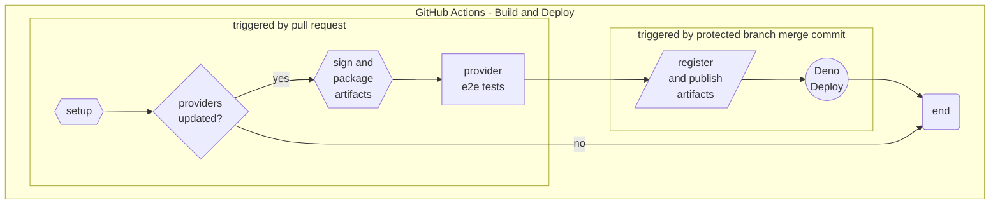

# Build and Deployment Workflow

The following diagram shows the CI/CD flow for this repository.  

The nodes in the above graph are described in the sections below:  

<!--ts-->
  * [setup](#setup)
  * [package artifacts](#package-artifacts)
  * [provider tests](#provider-tests)
  * [register and store artifacts](#register-and-store-artifacts)
  * [Deno Deploy](#deno-deploy)
<!--te-->

The following steps are performed on all pull requests to protected branches `dev` or `main` (if providers were updated):  

#### Setup

Pre workflow setup steps. Steps include:  

- `[SETUP] checkout repo`
- `[SETUP] setup job` - sets up job variables
- `[SETUP] print env vars`
- `[SETUP] get version` - gets the version of the provider(s) being updated
- `[SETUP] find changed files`
- `[SETUP] get updated providers`

#### Package Artifacts *(if providers were updated)*

Provider docs are signed and packaged for distribution, see [docs/signing-and-verification.md](signing-and-verification.md) for more specifics.  Steps include:  

- `[PACKAGE] set up golang`
- `[PACKAGE] build sign tool`
- `[PACKAGE] prepare dist and test dirs`
- `[PACKAGE] update versions` - update version in `provider.yaml` for updated providers to the version allocated earlier in the workflow
- `[PACKAGE] sign provider docs`
- `[PACKAGE] package provider docs`

#### Provider Tests *(if providers were updated)*

End-to-end tests will be performed on the new provider version using [stackql-provider-tests](https://github.com/stackql/stackql-provider-tests).  The following rules are evaluated:  

- [x] Document must be a valid OpenAPI specification
- [x] All services should be enumerable for resources
- [x] All resources should be enumerable for methods
- [x] Methods callable via `SELECT` must have a valid response schema
- [x] Methods callable via `INSERT` must have a valid request schema

Steps include:  

- `[TESTS] simulate REGISTRY PULL`
- `[TESTS] test provider(s)`

> The following steps are performed only on pushes to protected branches (merge commits) if providers were updated

#### Publish Artifacts to Provider Registry Artifact Repository

Packaged artifacts are published to the artifact repository in AWS S3 bucket (`stackql-registry-artifacts`).  Steps include:  

- `[PUBLISH] configure aws credentials`
- `[PUBLISH] publish provider docs to artifact repo`

#### Deno Deploy

Provider docs are prepared for distribution via [Deno Deploy](https://deno.com/deploy); this includes pulling the latest versions of the provider docs from the artifact repository and preparing the `index.ts` file for distribution.  Steps include:

- `[DEPLOY] setup SSH`
- `[DEPLOY] pull deno deploy assets`
- `[DEPLOY] pull additional docs from artifact repo`
- `[DEPLOY] install deno`

The public StackQL Provider Registry is distributed via [Deno Deploy](https://deno.com/deploy), using the following endpoints:  

| Endpoint | Description |
| --- | --- |
| [registry.stackql.app](https://registry.stackql.app/ping) | Production registry (built from `main`) |
| [registry-dev.stackql.app](https://registry.stackql.app/ping) | Development registry (built from `dev`) |

Steps include:  

- `[DEPLOY] deploy to deno deploy`
