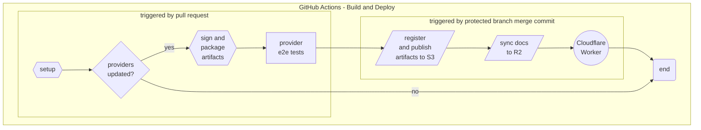

# Build and Deployment Workflow

The following diagram shows the CI/CD flow for this repository.  


```mermaid
  flowchart LR
  subgraph Actions[GitHub Actions - Build and Deploy]
    direction LR
    subgraph PR[triggered by pull request]
        Setup{{setup}} --> ProvUpd{providers\nupdated?}
        ProvUpd -->|yes| SignAndPackage{{ sign and\npackage\nartifacts }}
        SignAndPackage --> Tests[provider\ne2e tests]
    end
    subgraph Push[triggered by protected branch merge commit]
        Tests --> PushArtifacts[/register\nand publish\nartifacts to S3/]
        PushArtifacts --> SyncR2[/sync docs\nto R2/]
        SyncR2 --> Worker((Cloudflare\nWorker))
    end
    Worker --> End(end)
    ProvUpd -->|no| End
  end
```

The nodes in the above graph are described in the sections below:  

<!--ts-->
  * [setup](#setup)
  * [package artifacts](#package-artifacts)
  * [provider tests](#provider-tests)
  * [register and store artifacts](#register-and-store-artifacts)
  * [serve from Cloudflare](#serve-from-cloudflare)
  * [provider delete guard](#provider-delete-guard)
<!--te-->

The following steps are performed on all pull requests to protected branches `dev` or `main` (if providers were updated):  

#### Setup

Pre workflow setup steps. Steps include:  

- `[SETUP] checkout repo`
- `[SETUP] setup job` - sets up job variables
- `[SETUP] print env vars`
- `[SETUP] get version` - gets the version of the provider(s) being updated
- `[SETUP] find changed files`
- `[SETUP] get updated providers`

#### Package Artifacts *(if providers were updated)*

Provider docs are signed and packaged for distribution, see [docs/signing-and-verification.md](signing-and-verification.md) for more specifics.  Steps include:  

- `[PACKAGE] set up golang`
- `[PACKAGE] build sign tool`
- `[PACKAGE] prepare dist and test dirs`
- `[PACKAGE] update versions` - update version in `provider.yaml` for updated providers to the version allocated earlier in the workflow
- `[PACKAGE] sign provider docs`
- `[PACKAGE] package provider docs`

#### Provider Tests *(if providers were updated)*

End-to-end tests will be performed on the new provider version using [stackql-provider-tests](https://github.com/stackql/stackql-provider-tests).  The following rules are evaluated:  

- [x] Document must be a valid OpenAPI specification
- [x] All services should be enumerable for resources
- [x] All resources should be enumerable for methods
- [x] Methods callable via `SELECT` must have a valid response schema
- [x] Methods callable via `INSERT` must have a valid request schema

Steps include:  

- `[TESTS] simulate REGISTRY PULL`
- `[TESTS] test provider(s)`

> The following steps are performed only on pushes to protected branches (merge commits) if providers were updated

#### Publish Artifacts to Provider Registry Artifact Repository

Packaged artifacts are published to the master/archive artifact repository in AWS S3 bucket (`stackql-registry-artifacts`). The full registry tree is then reconstructed from S3 so the complete set of provider docs (plus a freshly generated `providers.yaml`) is available for the serving layer. Steps include:  

- `[PUBLISH] configure aws credentials`
- `[PUBLISH] publish provider docs to artifact repo`
- `[DEPLOY] pull additional docs from artifact repo`

#### Serve from Cloudflare

S3 remains the master/archive store. The reconstructed docs tree is mirrored to Cloudflare R2, and a [Cloudflare Worker](../origin) (source in [origin/](../origin)) serves provider docs from R2 at the edge, logging download analytics to D1. Steps include:  

- `[DEPLOY-CF] install worker deps`
- `[DEPLOY-CF] sync docs to R2 (dev)` / `[DEPLOY-CF] sync docs to R2 (prod)`
- `[DEPLOY-CF] deploy worker (dev)` / `[DEPLOY-CF] deploy worker (prod)`

The public StackQL Provider Registry is served from Cloudflare, using the following endpoints:  

| Endpoint | Description |
| --- | --- |
| [registry.stackql.app](https://registry.stackql.app/ping) | Production registry (built from `main`) |
| [registry-dev.stackql.app](https://registry-dev.stackql.app/ping) | Development registry (built from `dev`) |

## Provider Delete Guard

A separate workflow, [provider-delete-guard.yml](../.github/workflows/provider-delete-guard.yml), runs on every push to any branch (feature or protected) and on pull requests to `dev` or `main`. It fails the run if any provider under `providers/src` that existed in the comparison base no longer exists in the pushed commit. This is a safety net against a regeneration script or a bad merge silently removing a provider from the registry source.

A provider is considered present in a commit if `providers/src/<provider>/<version>/provider.yaml` exists for at least one version. Adding, changing or deleting files within a provider (for example regenerating service docs) does not trigger the guard.

The pushed commit is compared against:  

| Event | Comparison base(s) |
| --- | --- |
| push to an existing branch | the previous tip of the branch, and the fork point with the default branch |
| push creating a new branch (or a force push whose old tip is unreachable) | the fork point with the default branch |
| pull request | the tip of the target branch |
| manual run (`workflow_dispatch`) | the `base` input, or the fork point with the default branch |

The check is implemented in [scripts/cicd/shell/provider-delete-guard.sh](../scripts/cicd/shell/provider-delete-guard.sh) and can be run locally against any two refs, for example:  

```bash
bash scripts/cicd/shell/provider-delete-guard.sh HEAD origin/dev
```

### Overriding the guard

If a provider is being intentionally removed, add an explicit override token naming each provider to the message of a commit in the push (the commit that deletes the provider, or any later commit in the same push). Every deleted provider must be named; wildcards are not supported.

```text
[allow-provider-delete: netlify]
[allow-provider-delete: netlify, deno]
```

The guard reports allowed deletions as warnings in the job log and summary, so the override is visible in the run and permanently recorded in the git history. When merging a branch that deletes a provider using a squash merge, make sure the override token is retained in the squash commit message.

Notes:  

- Removing a provider from `providers/src` does not remove previously published versions from the artifact repository or the registry; those are managed separately.
- GitHub skips all push and pull request workflows, including this guard, when the head commit message contains `[skip ci]`. Do not use `[skip ci]` on commits that touch `providers/src`.
